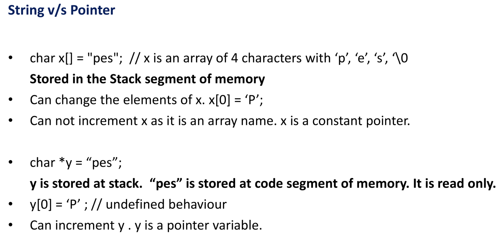

# PDF-1 : Strings in C

A **string** in C is an array of characters terminated by a null character (`\0`).

## Key Characteristics
- **ASCII Value of `\0`**: 0
- **String Constants**: Enclosed in double quotes (`" "`)
- **Memory**: Occupies 1 extra byte to store the null terminator (`\0`).
- **Character Size**: Generally, a `char` occupies 1 byte.

## Syntax
```c
char var_name[size]; // Size is compulsory when declaring
```

## Initialization
Strings can be initialized in two ways:

1. **Shorthand Notation**:
   ```c
   char var_name[size] = "string"; // Size is optional
   ```
   - The compiler automatically adds the null terminator (`\0`).
   - Example: `char name[] = "Hello";` creates an array of 6 bytes (`H`, `e`, `l`, `l`, `o`, `\0`).

2. **Explicit Array Notation**:
   ```c
   char var_name[size] = {'c', 'h', 'a', 'r', 'a', 'c', 't', 'e', 'r', '\0'}; // Size is optional
   ```
   - Explicitly define each character, including the null terminator.

## Notes
- The size of the array must be large enough to hold the string and the null terminator.
- If the size is not specified during shorthand initialization, the compiler determines it based on the string length (including `\0`).
- Strings can be manipulated using standard library functions like `strlen()`, `strcpy()`, `strcmp()`, etc., defined in `<string.h>`.

## Example
```c
#include <stdio.h>

int main() {
    char str1[] = "Hello";
    char str2[6] = {'W', 'o', 'r', 'l', 'd', '\0'};

    printf("String 1: %s\n", str1); // Output: Hello
    printf("String 2: %s\n", str2); // Output: World

    return 0;
}
```

```c
#include <stdio.h>

int main() {
    // Hardcoded string
    char hardcoded[] = "Hello, world!\0";
    printf("Hardcoded string: %s\n", hardcoded);

    // scanf with %s (stops at space)
    char word[50];
    printf("\nEnter a word: ");
    scanf("%s", word);
    printf("You entered (word only): %s\n", word);

    // Clear input buffer before using gets or %[^\n]
    while (getchar() != '\n');

    // scanf with %[^\n] (reads full line)
    char line1[100];
    printf("\nEnter a full line (scanf [^\\n]): ");
    scanf("%[^\n]", line1);
    printf("You entered (full line using scanf): %s\n", line1);

    // Clear buffer again
    while (getchar() != '\n');

    // gets() function (reads full line including spaces)
    char line2[100];
    printf("\nEnter a full line (gets): ");
    gets(line2);  // WARNING: ChatGPT said, its not safe, memory corrution lmao.
    printf("You entered (full line using gets): %s\n", line2);

    return 0;
}

```


---


# PDF-2&3 : String manipulation Functions & Errors

### Common String Functions -->

From the `<string.h>` library (use `#include <string.h>`).

## 1. `strcat()` - Combines Two Strings

- **Purpose**: Appends source string to destination.
- **Syntax**:
  ```c
  strcat(destination, source);
  ```
- **Note**: Destination must have enough space.

### Example
```c
#include <stdio.h>
#include <string.h>

int main() {
    char str1[20] = "Hello, ";
    char str2[] = "World!";
    strcat(str1, str2);
    printf("Combined string: %s\n", str1); // Output: Combined string: Hello, World!
    return 0;
}
```

---

## 2. `strlen()` - Length of a String

- **Purpose**: Counts characters, excluding `\0`.
- **Syntax**:
  ```c
  strlen(string);
  ```

### Example
```c
#include <stdio.h>
#include <string.h>

int main() {
    char str[] = "Hamilton";
    int length = strlen(str);
    printf("Length of '%s': %d\n", str, length); // Output: Length of 'Hamilton': 8
    return 0;
}
```

---

## 3. Reverses a String

- **Purpose**: Reverses character order.

### Custom Reverse
```c
#include <stdio.h>
#include <string.h>

void reverse(char str[]) {
    int i, j;
    char temp;
    for (i = 0, j = strlen(str) - 1; i < j; i++, j--) {
        temp = str[i];
        str[i] = str[j];
        str[j] = temp;
    }
}

int main() {
    char str[] = "Hamilton";
    reverse(str);
    printf("Reversed string: %s\n", str); // Output: Reversed string: notlimaH
    return 0;
}
```

---

## 4. `strcpy()` - Copies One String into Another

- **Purpose**: Copies source string (with `\0`) to destination.
- **Syntax**:
  ```c
  strcpy(destination, source);
  ```
- **Note**: Destination needs enough space.

### Example
```c
#include <stdio.h>
#include <string.h>

int main() {
    char source[] = "Hamilton";
    char destination[20];
    strcpy(destination, source);
    printf("Copied string: %s\n", destination); // Output: Copied string: Hamilton
    return 0;
}
```

---

## 5. `strcmp()` - Compares Two Strings

- **Purpose**: Compares strings lexicographically.
- **Syntax**:
  ```c
  strcmp(string1, string2);
  ```
- **Returns**: `0` (equal), positive (`string1 > string2`), negative (`string1 < string2`).

### Example
```c
#include <stdio.h>
#include <string.h>

int main() {
    char str1[] = "Apple";
    char str2[] = "Banana";
    int result = strcmp(str1, str2);
    if (result < 0)
        printf("'%s' comes before '%s'\n", str1, str2); // Output: 'Apple' comes before 'Banana'
    return 0;
}
```

---

## 6. `strchr()` - Locates Character in String

- **Purpose**: Finds the first occurrence of a character in a string.
- **Syntax**:
  ```c
  char *strchr(const char *string, int character);
  ```
- **Returns**: Pointer to the first occurrence of `character` in `string`, or `NULL` if not found.
- **Note**: The `character` is passed as an `int` but interpreted as a `char`.

### Example
```c
#include <stdio.h>
#include <string.h>

int main() {
    char str[] = "Hamilton";
    char ch = 'm';
    char *result = strchr(str, ch);
    if (result != NULL)
        printf("Character '%c' found at position: %ld\n", ch, result - str); // Output: Character 'm' found at position: 2
    else
        printf("Character '%c' not found\n", ch);
    return 0;
}
```
---

# PDF-4 : Command Line Arguments

---

Command line arguments allows to pass data to a C program **while executing it** in the terminal.

### Example:
```bash
a.exe 18 27
```
- `a.exe` is the compiled program
- `18` and `27` are arguments passed to it

All the arguments passed this way are **received as strings** inside C program. If you're passing numbers, you need to **convert** them using `atoi()` (ASCII to integer).

---

## argc and argv

To accept command line arguments, `main()` function should be like this:
```c
int main(int argc, char *argv[]) {
    // insert code :)
}
```

- **`argc`** (Argument Count):
  - Tells, how many arguments were passed.
  - Example: `a.exe 18 27` → `argc` is 3

- **`argv`** (Argument Vector):
  - An array of strings (char pointers) that holds all the arguments:
    - `argv[0]` → "a.exe"
    - `argv[1]` → "18"
    - `argv[2]` → "27"

You can loop through `argv[]` to access and use each argument.

---

## Sum of Command Line Numbers

Sum of numbers passed through the command line:

### Sample Code:
```c
#include <stdio.h>
#include <stdlib.h> // for atoi()

int main(int argc, char *argv[]) {
    int sum = 0;
    for (int i = 1; i < argc; i++) {
        sum += atoi(argv[i]);
    }
    printf("Sum: %d\n", sum);
    return 0;
}
```

### Example Run:
```bash
a.exe 10 20 30
```
**Output:**
```
Sum: 60
```

---

# PDF-5 : Dynamic Memory Management
---

## 1. Problem with Fixed-Size Arrays

- Fixed arrays can be inefficient when:
  - The amount of data isn't known beforehand.
  - The number of data elements changes during execution.

### Issues:
- **Wastage**: Allocating more space than needed.
- **Shortage**: Allocating less space than needed.

**Example**:  
```c
int A[1000]; // wastes memory if only 50 elements are used
```

**Solution**: Use **Dynamic Memory Management**.

---

## 2. Types of Memory Allocation

### a. Static Allocation
- Handled by the compiler.
- Done at load time.
- Example: `int a; float b; int arr[20];`

### b. Automatic Allocation
- Also decided by the compiler.
- Done at runtime during function calls (stack).
- Memory is freed when the function ends.

### c. Dynamic Allocation
- Done explicitly using memory functions.
- Memory is managed during runtime.
- Uses the **heap** memory region.

---

## 3. Dynamic Memory Allocation Functions

All available in `<stdlib.h>`

### a. `malloc()`
- Allocates a block of uninitialized memory.
- Returns a `void*` pointer.
```c
int* ptr = (int*) malloc(sizeof(int));
```

### b. `calloc()`
- Allocates memory for multiple elements and initializes them to zero.
```c
int* ptr = (int*) calloc(3, sizeof(int));
```

### c. `realloc()`
- Resizes a previously allocated block.
```c
ptr = (int*) realloc(ptr, new_size);
```
- Preserves content up to the minimum of old and new size.
- If expansion isn’t possible, moves to a new block.

### d. `free()`
- Frees the dynamically allocated memory.
```c
free(ptr);
```
- No need to specify size.  
- Internally tracked by the system using **bookkeeping info**.

---

# PDF-6 : Dynamic Memory Management Erros

## 1. Dangling Pointer

| Issue | Description |
|-------|-------------|
| Definition | Pointer pointing to deallocated memory |
| Cause | Memory is freed but pointer still holds the address |
| Effect | Dereferencing causes undefined behavior |
| Fix | Set the pointer to `NULL` after `free()` |

### Example Scenario
```c
int* ptr = (int*) malloc(sizeof(int));
free(ptr);  // memory is deallocated
// ptr still points to the same address - this is dangling
ptr = NULL; // solution
```

---

## 2. NULL Pointer

- Occurs when a pointer is initialized or reset to `NULL`.
- **Dereferencing a NULL pointer causes a guaranteed crash.**

### Safe Practice:
```c
if (ptr != NULL) {
    // safe to use ptr
}
```

---

## 3. Garbage Memory

| Issue | Description |
|-------|-------------|
| Definition | Memory that has been allocated but is inaccessible (no reference) |
| Cause | Allocating memory to the same pointer without freeing it |
| Result | Memory leak (especially in heap) |

### Example:
```c
int* ptr = (int*) malloc(10);
ptr = (int*) malloc(20); // memory for 10 bytes lost (garbage)
```

---

## 4. Double Free Error

- Occurs when `free()` is called on a pointer that has already been freed.
- **Results in undefined behavior**, possibly corrupting memory.

### Bad Practice:
```c
free(ptr);
free(ptr); // double free - avoid this!
```

### Safe Practice:
```c
free(ptr);
ptr = NULL;
```

---

## 5. Visualizing Dangling Pointer

### Before `free()`:
```
Heap:    [5000] [5001] [5002] ...
Pointer: ptr --> 5000
```

### After `free()`:
```
Heap:    Memory at 5000 deallocated
Pointer: ptr still --> 5000 (Dangling!)
Fix:     ptr = NULL;
```

---