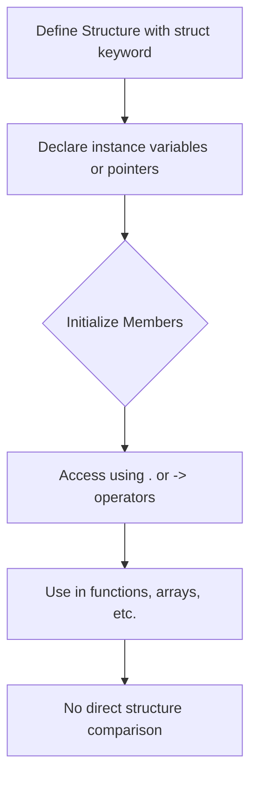
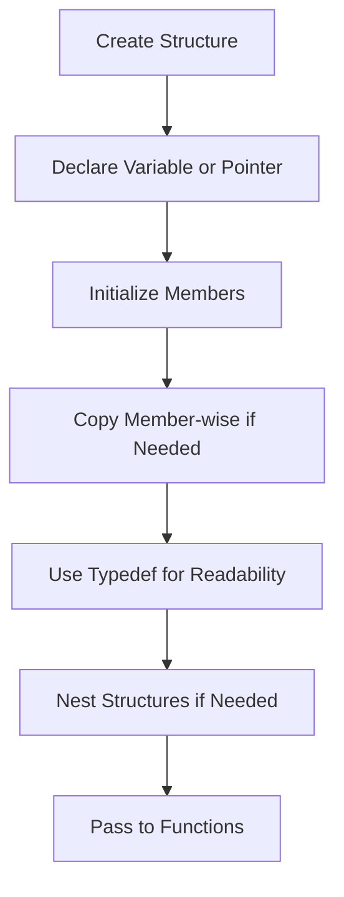
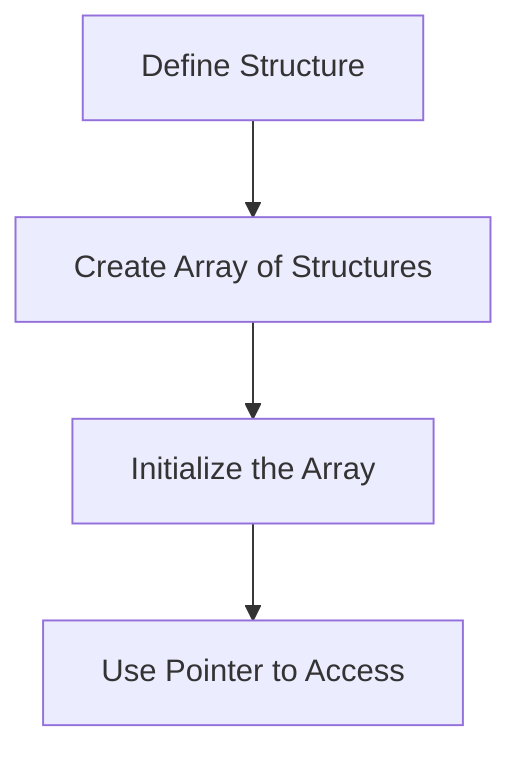
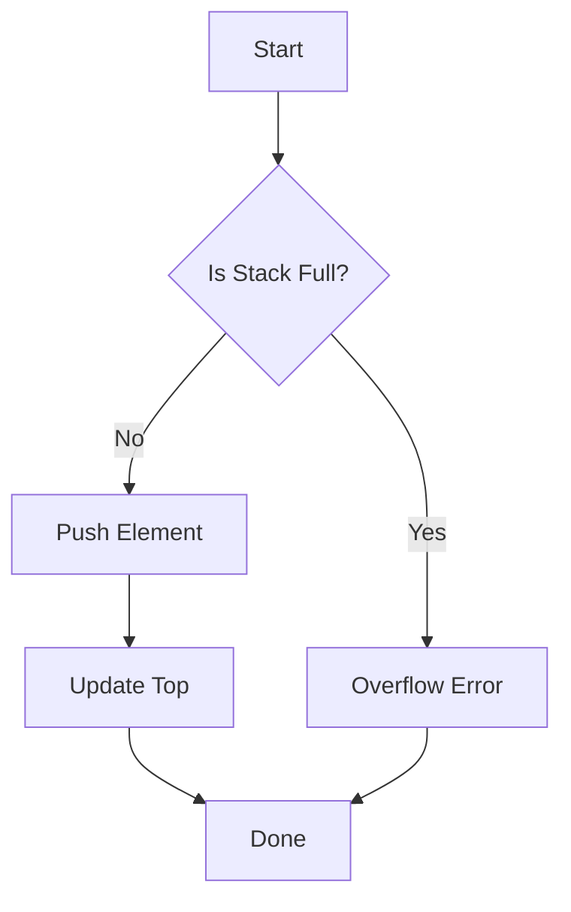
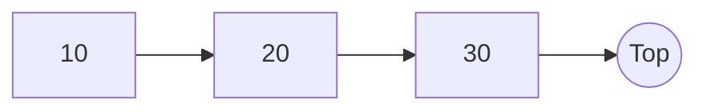
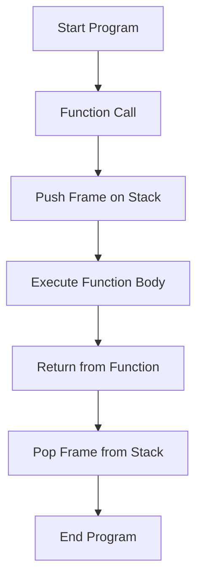
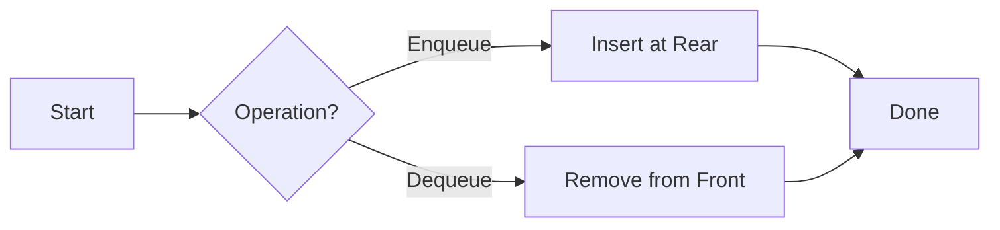
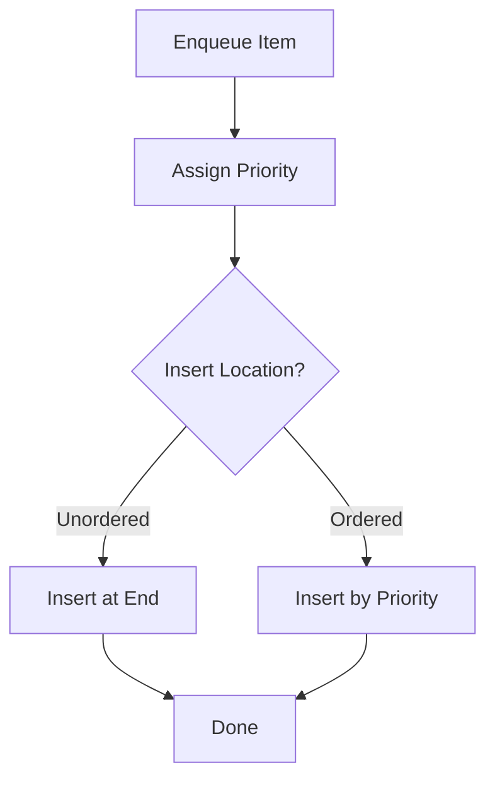

# PDF-1 : Strings in C

A **string** in C is an array of characters terminated by a null character (`\0`).

## Key Characteristics
- **ASCII Value of `\0`**: 0
- **String Constants**: Enclosed in double quotes (`" "`)
- **Memory**: Occupies 1 extra byte to store the null terminator (`\0`).
- **Character Size**: Generally, a `char` occupies 1 byte.

## Syntax
```c
char var_name[size]; // Size is compulsory when declaring
```

## Initialization
Strings can be initialized in two ways:

1. **Shorthand Notation**:
   ```c
   char var_name[size] = "string"; // Size is optional
   ```
   - The compiler automatically adds the null terminator (`\0`).
   - Example: `char name[] = "Hello";` creates an array of 6 bytes (`H`, `e`, `l`, `l`, `o`, `\0`).

2. **Explicit Array Notation**:
   ```c
   char var_name[size] = {'c', 'h', 'a', 'r', 'a', 'c', 't', 'e', 'r', '\0'}; // Size is optional
   ```
   - Explicitly define each character, including the null terminator.

## Notes
- The size of the array must be large enough to hold the string and the null terminator.
- If the size is not specified during shorthand initialization, the compiler determines it based on the string length (including `\0`).
- Strings can be manipulated using standard library functions like `strlen()`, `strcpy()`, `strcmp()`, etc., defined in `<string.h>`.

## Example
```c
#include <stdio.h>

int main() {
    char str1[] = "Hello";
    char str2[6] = {'W', 'o', 'r', 'l', 'd', '\0'};

    printf("String 1: %s\n", str1); // Output: Hello
    printf("String 2: %s\n", str2); // Output: World

    return 0;
}
```

```c
#include <stdio.h>

int main() {
    // Hardcoded string
    char hardcoded[] = "Hello, world!\0";
    printf("Hardcoded string: %s\n", hardcoded);

    // scanf with %s (stops at space)
    char word[50];
    printf("\nEnter a word: ");
    scanf("%s", word);
    printf("You entered (word only): %s\n", word);

    // Clear input buffer before using gets or %[^\n]
    while (getchar() != '\n');

    // scanf with %[^\n] (reads full line)
    char line1[100];
    printf("\nEnter a full line (scanf [^\\n]): ");
    scanf("%[^\n]", line1);
    printf("You entered (full line using scanf): %s\n", line1);

    // Clear buffer again
    while (getchar() != '\n');

    // gets() function (reads full line including spaces)
    char line2[100];
    printf("\nEnter a full line (gets): ");
    gets(line2);  // WARNING: ChatGPT said, its not safe, memory corrution lmao.
    printf("You entered (full line using gets): %s\n", line2);

    return 0;
}

```


---


# PDF-2&3 : String manipulation Functions & Errors

### Common String Functions -->

From the `<string.h>` library (use `#include <string.h>`).

## 1. `strcat()` - Combines Two Strings

- **Purpose**: Appends source string to destination.
- **Syntax**:
  ```c
  strcat(destination, source);
  ```
- **Note**: Destination must have enough space.

### Example
```c
#include <stdio.h>
#include <string.h>

int main() {
    char str1[20] = "Hello, ";
    char str2[] = "World!";
    strcat(str1, str2);
    printf("Combined string: %s\n", str1); // Output: Combined string: Hello, World!
    return 0;
}
```

---

## 2. `strlen()` - Length of a String

- **Purpose**: Counts characters, excluding `\0`.
- **Syntax**:
  ```c
  strlen(string);
  ```

### Example
```c
#include <stdio.h>
#include <string.h>

int main() {
    char str[] = "Hamilton";
    int length = strlen(str);
    printf("Length of '%s': %d\n", str, length); // Output: Length of 'Hamilton': 8
    return 0;
}
```

---

## 3. Reverses a String

- **Purpose**: Reverses character order.

### Custom Reverse
```c
#include <stdio.h>
#include <string.h>

void reverse(char str[]) {
    int i, j;
    char temp;
    for (i = 0, j = strlen(str) - 1; i < j; i++, j--) {
        temp = str[i];
        str[i] = str[j];
        str[j] = temp;
    }
}

int main() {
    char str[] = "Hamilton";
    reverse(str);
    printf("Reversed string: %s\n", str); // Output: Reversed string: notlimaH
    return 0;
}
```

---

## 4. `strcpy()` - Copies One String into Another

- **Purpose**: Copies source string (with `\0`) to destination.
- **Syntax**:
  ```c
  strcpy(destination, source);
  ```
- **Note**: Destination needs enough space.

### Example
```c
#include <stdio.h>
#include <string.h>

int main() {
    char source[] = "Hamilton";
    char destination[20];
    strcpy(destination, source);
    printf("Copied string: %s\n", destination); // Output: Copied string: Hamilton
    return 0;
}
```

---

## 5. `strcmp()` - Compares Two Strings

- **Purpose**: Compares strings lexicographically.
- **Syntax**:
  ```c
  strcmp(string1, string2);
  ```
- **Returns**: `0` (equal), positive (`string1 > string2`), negative (`string1 < string2`).

### Example
```c
#include <stdio.h>
#include <string.h>

int main() {
    char str1[] = "Apple";
    char str2[] = "Banana";
    int result = strcmp(str1, str2);
    if (result < 0)
        printf("'%s' comes before '%s'\n", str1, str2); // Output: 'Apple' comes before 'Banana'
    return 0;
}
```

---

## 6. `strchr()` - Locates Character in String

- **Purpose**: Finds the first occurrence of a character in a string.
- **Syntax**:
  ```c
  char *strchr(const char *string, int character);
  ```
- **Returns**: Pointer to the first occurrence of `character` in `string`, or `NULL` if not found.
- **Note**: The `character` is passed as an `int` but interpreted as a `char`.

### Example
```c
#include <stdio.h>
#include <string.h>

int main() {
    char str[] = "Hamilton";
    char ch = 'm';
    char *result = strchr(str, ch);
    if (result != NULL)
        printf("Character '%c' found at position: %ld\n", ch, result - str); // Output: Character 'm' found at position: 2
    else
        printf("Character '%c' not found\n", ch);
    return 0;
}
```
---

# PDF-4 : Command Line Arguments

---

Command line arguments allows to pass data to a C program **while executing it** in the terminal.

### Example:
```bash
a.exe 18 27
```
- `a.exe` is the compiled program
- `18` and `27` are arguments passed to it

All the arguments passed this way are **received as strings** inside C program. If you're passing numbers, you need to **convert** them using `atoi()` (ASCII to integer).

---

## argc and argv

To accept command line arguments, `main()` function should be like this:
```c
int main(int argc, char *argv[]) {
    // insert code :)
}
```

- **`argc`** (Argument Count):
  - Tells, how many arguments were passed.
  - Example: `a.exe 18 27` → `argc` is 3

- **`argv`** (Argument Vector):
  - An array of strings (char pointers) that holds all the arguments:
    - `argv[0]` → "a.exe"
    - `argv[1]` → "18"
    - `argv[2]` → "27"

You can loop through `argv[]` to access and use each argument.

---

## Sum of Command Line Numbers

Sum of numbers passed through the command line:

### Sample Code:
```c
#include <stdio.h>
#include <stdlib.h> // for atoi()

int main(int argc, char *argv[]) {
    int sum = 0;
    for (int i = 1; i < argc; i++) {
        sum += atoi(argv[i]);
    }
    printf("Sum: %d\n", sum);
    return 0;
}
```

### Example Run:
```bash
a.exe 10 20 30
```
**Output:**
```
Sum: 60
```

---

# PDF-5 : Dynamic Memory Management
---

## 1. Problem with Fixed-Size Arrays

- Fixed arrays can be inefficient when:
  - The amount of data isn't known beforehand.
  - The number of data elements changes during execution.

### Issues:
- **Wastage**: Allocating more space than needed.
- **Shortage**: Allocating less space than needed.

**Example**:  
```c
int A[1000]; // wastes memory if only 50 elements are used
```

**Solution**: Use **Dynamic Memory Management**.

---

## 2. Types of Memory Allocation

### a. Static Allocation
- Handled by the compiler.
- Done at load time.
- Example: `int a; float b; int arr[20];`

### b. Automatic Allocation
- Also decided by the compiler.
- Done at runtime during function calls (stack).
- Memory is freed when the function ends.

### c. Dynamic Allocation
- Done explicitly using memory functions.
- Memory is managed during runtime.
- Uses the **heap** memory region.

---

## 3. Dynamic Memory Allocation Functions

All available in `<stdlib.h>`

### a. `malloc()`
- Allocates a block of uninitialized memory.
- Returns a `void*` pointer.
```c
int* ptr = (int*) malloc(sizeof(int));
```

### b. `calloc()`
- Allocates memory for multiple elements and initializes them to zero.
```c
int* ptr = (int*) calloc(3, sizeof(int));
```

### c. `realloc()`
- Resizes a previously allocated block.
```c
ptr = (int*) realloc(ptr, new_size);
```
- Preserves content up to the minimum of old and new size.
- If expansion isn’t possible, moves to a new block.

### d. `free()`
- Frees the dynamically allocated memory.
```c
free(ptr);
```
- No need to specify size.  
- Internally tracked by the system using **bookkeeping info**.

---

# PDF-6 : Dynamic Memory Management Erros

## 1. Dangling Pointer

| Issue | Description |
|-------|-------------|
| Definition | Pointer pointing to deallocated memory |
| Cause | Memory is freed but pointer still holds the address |
| Effect | Dereferencing causes undefined behavior |
| Fix | Set the pointer to `NULL` after `free()` |

### Example Scenario
```c
int* ptr = (int*) malloc(sizeof(int));
free(ptr);  // memory is deallocated
// ptr still points to the same address - this is dangling
ptr = NULL; // solution
```

---

## 2. NULL Pointer

- Occurs when a pointer is initialized or reset to `NULL`.
- **Dereferencing a NULL pointer causes a guaranteed crash.**

### Safe Practice:
```c
if (ptr != NULL) {
    // safe to use ptr
}
```

---

## 3. Garbage Memory

| Issue | Description |
|-------|-------------|
| Definition | Memory that has been allocated but is inaccessible (no reference) |
| Cause | Allocating memory to the same pointer without freeing it |
| Result | Memory leak (especially in heap) |

### Example:
```c
int* ptr = (int*) malloc(10);
ptr = (int*) malloc(20); // memory for 10 bytes lost (garbage)
```

---

## 4. Double Free Error

- Occurs when `free()` is called on a pointer that has already been freed.
- **Results in undefined behavior**, possibly corrupting memory.

### Bad Practice:
```c
free(ptr);
free(ptr); // double free - avoid this!
```

### Safe Practice:
```c
free(ptr);
ptr = NULL;
```

---

## 5. Visualizing Dangling Pointer

### Before `free()`:
```
Heap:    [5000] [5001] [5002] ...
Pointer: ptr --> 5000
```

### After `free()`:
```
Heap:    Memory at 5000 deallocated
Pointer: ptr still --> 5000 (Dangling!)
Fix:     ptr = NULL;
```

---

# PDF- 7&8 : Structures in C

## Introduction

| Key Point | Description |
|:---|:---|
| **Definition** | A user-defined data type combining different types of data. |
| **Purpose** | To group related but different types of data under a single name. |
| **Use Cases** | When a lot of different data needs to be grouped meaningfully. |
| **Memory Layout** | Binary layout decided at type creation. |

> **Think of it like a custom backpack where you can pack books, snacks, and your tablet together — all different items, but neatly organized!**

---

## Characteristics/Properties

| Feature | Details |
|:---|:---|
| **Components** | One or more named data members (homogeneous or heterogeneous). |
| **Field Order** | Order and size decided at type creation. |
| **Memory Size** | At least the sum of member sizes; compiler decides offsets. |
| **Assignment** | Compatible structures can be assigned directly. |

---

## Syntax

```c
struct <structure_name> {
    data_type member1;
    data_type member2;
    ...
    data_type membern;
}; // Important: semicolon needed!
```

### Example:
```c
struct Student {
    int roll_no;
    char name[20];
    int marks;
};
```

---

## Declaration

| Syntax | Example |
|:---|:---|
| **Normal variable** | `struct Student s1;` |
| **Pointer variable** | `struct Student* s2;` |

> **Tip:** No memory is allocated when you just define the structure. Only when you declare an instance like `s1` or `s2`.

---

## Initialization

- Use `{}` braces to initialize.
- Values are automatically mapped to members.

### Types of Initialization:
| Type | Details | Example |
|:---|:---|:---|
| **Complete** | All values provided. | `struct Student s1 = {1, "John", 90};` |
| **Partial** | Some values given; others default to 0 or '\0'. | `struct Student s2 = {2};` |
| **Designated (C99)** | Initialize by member name, any order. | `struct Student s3 = {.marks=85, .roll_no=3};` |

---

## Accessing Members

| Method | Syntax | Example |
|:---|:---|:---|
| **Dot Operator (.)** | `struct_var.member_name` | `s1.roll_no` |
| **Arrow Operator (->)** | `pointer_var->member_name` | `s2->roll_no` |

> **Quick Hint:** Use `.` when you have an object, `->` when you have a pointer.

---

## Memory Allocation

- Total size is at least the sum of all data members' sizes.
- Offset and padding decided at compile time.
- Implementation-specific variations exist.

---

## Comparison of Structures

| Can you directly compare structures? |
|:---|
| No, you cannot use `==` or `!=` directly between structures. |

### How?
- You must compare each member individually.

### Example:
```c
if (s1.roll_no == s2->roll_no) {
    printf("Same roll numbers!\n");
}
```

---

## Flowchart: Working with Structures



---

## Final Cheat Sheet

| Concept | Keyword/Operator | Example |
|:---|:---|:---|
| Create Structure | `struct` | `struct Student {...};` |
| Dot Operator | `.` | `s1.name` |
| Pointer Access | `->` | `s2->marks` |
| Initialize | `{}` or Designated | `{1, "A", 90}` or `{.marks=90}` |
| Compare Members | Individually | `if (s1.roll_no == s2->roll_no)` |

---

## Examples

### Example 1: Basic Structure Usage
```c
#include <stdio.h>

struct Student {
    int roll_no;
    char name[20];
    int marks;
};

int main() {
    struct Student s1 = {1, "Alice", 95};
    printf("Roll No: %d\n", s1.roll_no);
    printf("Name: %s\n", s1.name);
    printf("Marks: %d\n", s1.marks);
    return 0;
}
```

### Example 2: Structure with Pointer
```c
#include <stdio.h>

struct Student {
    int roll_no;
    char name[20];
    int marks;
};

int main() {
    struct Student s1 = {2, "Bob", 88};
    struct Student* ptr = &s1;
    printf("Roll No: %d\n", ptr->roll_no);
    printf("Name: %s\n", ptr->name);
    printf("Marks: %d\n", ptr->marks);
    return 0;
}
```

### Example 3: Array of Structures
```c
#include <stdio.h>

struct Student {
    int roll_no;
    char name[20];
    int marks;
};

int main() {
    struct Student arr[2] = {{1, "Alice", 95}, {2, "Bob", 88}};
    for (int i = 0; i < 2; i++) {
        printf("Student %d: %s scored %d marks.\n", arr[i].roll_no, arr[i].name, arr[i].marks);
    }
    return 0;
}
```

# 1. Member-wise Copy

| Key Point      | Description                                                      |
| -------------- | ---------------------------------------------------------------- |
| **Definition** | Structures of the same type are assignment compatible.           |
| **Behavior**   | Member-wise copying happens; all values are copied individually. |
| **Memory**     | The copies are independent; no shared memory.                    |
| **Changes**    | Modification in one structure does not affect the other.         |

### Example

```c
#include <stdio.h>

struct Student {
    int roll_no;
    char name[20];
};

int main() {
    struct Student s1 = {1, "Alice"};
    struct Student s2;

    s2 = s1; // Member-wise copy

    printf("Original: %d %s\n", s1.roll_no, s1.name);
    printf("Copy: %d %s\n", s2.roll_no, s2.name);

    return 0;
}
```

---

# 2. Typedef

| Key Point   | Description                                        |
| ----------- | -------------------------------------------------- |
| **Purpose** | Creates an alias name for an existing type.        |
| **Scope**   | Can be used with primitive and user-defined types. |
| **Nature**  | No new type is created, only a new name.           |

### Syntax

```c
typedef <existing_type> <new_name>;
```

### Examples

| Without Typedef      | With Typedef                           |
| -------------------- | -------------------------------------- |
| `int a, b;`          | `typedef int integer;\ninteger a, b;`  |
| `struct Student s1;` | `typedef struct Student Stu;\nStu s1;` |

### Typedef with Structures Example

```c
#include <stdio.h>

typedef struct {
    int roll_no;
    char name[20];
} Student;

int main() {
    Student s1 = {101, "John"};
    printf("Roll No: %d\n", s1.roll_no);
    return 0;
}
```

---

# 3. Nested Structures

| Key Point      | Description                                   |
| -------------- | --------------------------------------------- |
| **Definition** | A structure defined inside another structure. |
| **Ways**       | Separate declaration and embedding directly.  |

### Way 1: Using Existing Structures

```c
struct Date {
    int day, month, year;
};

struct Student {
    int roll_no;
    struct Date dob;
};
```

### Way 2: Embedded Declaration

```c
struct Student {
    int roll_no;
    struct {
        int day, month, year;
    } dob;
};
```

### Nested Access Example

```c
#include <stdio.h>

struct Student {
    int roll_no;
    struct {
        int day, month, year;
    } dob;
};

int main() {
    struct Student s1 = {101, {15, 8, 2000}};
    printf("DOB: %d/%d/%d\n", s1.dob.day, s1.dob.month, s1.dob.year);
    return 0;
}
```

---

# 4. Passing Structures to Functions

| Key Point           | Description                                                                           |
| ------------------- | ------------------------------------------------------------------------------------- |
| **Default Passing** | Always by value (copy made).                                                          |
| **Modification**    | Modifications inside the function don't affect the original unless passed by pointer. |

### Passing by Value

```c
#include <stdio.h>

struct Student {
    int roll_no;
};

void display(struct Student s) {
    printf("Roll No: %d\n", s.roll_no);
}

int main() {
    struct Student s1 = {101};
    display(s1);
    return 0;
}
```

### Passing by Pointer

```c
#include <stdio.h>

struct Student {
    int roll_no;
};

void update(struct Student *s) {
    s->roll_no = 202;
}

int main() {
    struct Student s1 = {101};
    update(&s1);
    printf("Updated Roll No: %d\n", s1.roll_no);
    return 0;
}
```

---

# Final Visualization



---

# Quick Recap Table

| Concept          | Example                              |
| ---------------- | ------------------------------------ |
| Typedef          | `typedef struct {...} Name;`         |
| Nested Structure | `struct Student {struct Date dob;};` |
| Pass by Value    | `void func(struct Student s)`        |
| Pass by Pointer  | `void func(struct Student* s)`       |
| Member-wise Copy | `s2 = s1;`                           |

---

# PDF - 9 :  Arrays of Structures

---

## 1. Introduction

Imagine you need to store **Roll Number**, **Name**, and **Marks** for **one** student.

We use a simple **Structure**:

```c
struct student {
    int roll_no;
    char name[100];
    int marks;
};
```

Example:

```c
struct student s1 = {1, "Alice", 90};
printf("%d %s %d", s1.roll_no, s1.name, s1.marks);
```

---

But what if you have **100 students**?

You cannot create 100 different structures manually!
**Solution**: Use an **Array of Structures**.

```c
struct student S[100];
```

### Visualization

| Array Index | Roll No. | Name | Marks |
| ----------- | -------- | ---- | ----- |
| S[0]        | -        | -    | -     |
| S[1]        | -        | -    | -     |
| ...         | ...      | ...  | ...   |
| S[99]       | -        | -    | -     |

Each element stores **one student's details**.

Example:

```c
S[0].roll_no = 101;
strcpy(S[0].name, "Bob");
S[0].marks = 85;
```

---

## 2. Array of Structure Variable Definition

You can **define** array of structures in two ways:

### (a) Along with Structure Declaration

```c
struct student {
    int roll_no;
    char name[100];
    int marks;
} s[100];
```

Example:

```c
s[0].roll_no = 102;
strcpy(s[0].name, "Charlie");
s[0].marks = 75;
```

### (b) After Structure Declaration

```c
struct student s[100];
```

Example:

```c
s[1].roll_no = 103;
strcpy(s[1].name, "David");
s[1].marks = 88;
```

---

## 3. Array of Structure Variable Initialization

You can initialize **at Compile Time**:

```c
struct student S[] = {
    {1, "John", 60},
    {2, "Jack", 40},
    {3, "Jill", 77}
};
```

Example:

```c
printf("%d %s %d", S[0].roll_no, S[0].name, S[0].marks);
```

Or **Partially Initialize**:

```c
struct student S[2] = {
    {1, "John", 60},
    {2, "Jack", 40}
};
```

Example:

```c
printf("%d %s %d", S[1].roll_no, S[1].name, S[1].marks);
```

**At Runtime** (preferred for big data):

```c
for (int i = 0; i < 100; i++) {
    scanf("%d %s %d", &S[i].roll_no, S[i].name, &S[i].marks);
}
```

Example:

```c
for (int i = 0; i < 3; i++) {
    printf("%d %s %d\n", S[i].roll_no, S[i].name, S[i].marks);
}
```

---

## 4. Pointer to an Array of Structures

Pointers make accessing array elements super fast and efficient!

### Example:

```c
struct student ST[5];
struct student *ptr = ST;
```

Now you can access:

```c
(ptr + 1)->roll_no = 202;
strcpy((ptr + 1)->name, "Ella");
(ptr + 1)->marks = 92;

printf("%d %s %d", (ptr + 1)->roll_no, (ptr + 1)->name, (ptr + 1)->marks);
```

### Memory Layout Diagram:

```
| ST[0] | ST[1] | ST[2] | ST[3] | ST[4] |
 | 1000 | 1060  | 1120  | 1180  | 1240  |  (Assuming each struct takes 60 bytes)
```

- `ptr` points to `ST[0]`
- `ptr + 1` points to `ST[1]`
- `ptr + 2` points to `ST[2]`

---

## Flowchart



---

# Conclusion

- Structures store **different types** of related data.
- **Array of structures** helps manage **multiple entries** easily.
- **Pointers** make it **efficient and faster**.

---

Graph: Speed of Access

| Method         | Speed  |
| -------------- | ------ |
| Array Access   | Medium |
| Pointer Access | Fast   |


# PDF - 10 : Bit fields in C


## 1. What is a Bit Field?

- A **bit field** is a set of adjacent bits within a single memory word that represents values or flags.
- Variables have a **predefined width** (number of bits).
- **Purpose:**
  - Reduce memory usage
  - Implement compact structures
  - Enhance performance in specific scenarios

### Example:

```c
struct status {
    unsigned int flag1 : 1;  // 1 bit for flag1
    unsigned int flag2 : 1;  // 1 bit for flag2
    unsigned int mode  : 2;  // 2 bits for mode (values 0-3)
};

struct status s1;
s1.flag1 = 1;
s1.flag2 = 0;
s1.mode = 3;
```

- `flag1` and `flag2` can be either 0 or 1.
- `mode` can take values from 0 to 3.

---

## 2. Bit Field Creation

- **Syntax:**

```c
struct [tag] {
    type [member_name] : width;
};
```

| Part | Meaning |
| --- | --- |
| type | `int`, `signed int`, or `unsigned int` |
| member_name | Name of the bit field |
| width | Number of bits assigned |

- **Important:**
  - Width must be ≤ bit width of type.
  - Maximum value stored = \(2^n - 1\), where `n = width`

### Example:

```c
struct flags {
    unsigned int read  : 1;
    unsigned int write : 1;
    unsigned int exec  : 1;
};

struct flags file1 = {1, 0, 1};
printf("Read: %d, Write: %d, Execute: %d", file1.read, file1.write, file1.exec);
```

Output:
```
Read: 1, Write: 0, Execute: 1
```

---

## 3. Few Important Points about Bit Fields

| Point | Explanation |
| --- | --- |
| Starting Position | First field starts at the first bit of the word. No crossing of integer boundaries allowed. |
| Address Extraction | Cannot take the address (`&`) of a bit field member. |
| Range Limitation | Assign values only within their range. Behavior is undefined for out-of-range values. |
| Pointers | Cannot have pointers to individual bit fields because they may not start at a byte boundary. |
| Array Restriction | Arrays of bit fields are not allowed. |
| Storage Class | Cannot apply storage class specifiers (like `static`) directly to bit fields. |
| Union | Bit fields **can** be used inside a `union` to share memory. |
| Unnamed Fields | Useful for manual alignment and padding. |

### Example of Unnamed Bit Field (Padding):

```c
struct padded {
    unsigned int a : 4;
    unsigned int   : 4;  // 4 bits padding
    unsigned int b : 8;
};
```

### Example inside Union:

```c
union data {
    struct {
        unsigned int x : 4;
        unsigned int y : 4;
    } bits;
    unsigned char byte;
};

union data d;
d.byte = 0xAB;
printf("X: %d, Y: %d", d.bits.x, d.bits.y);
```

---

## Flowchart: How to Create a Bit Field

```mermaid
flowchart TD
    A[Define Structure] --> B[Choose Type (int/unsigned int)]
    B --> C[Declare Members with Widths]
    C --> D[Initialize Fields]
    D --> E[Use in Program]
```

---

# Conclusion

- **Bit fields** offer an efficient way to use memory when dealing with small flags or options.
- They are especially useful in **embedded systems**, **protocol development**, and **memory-critical applications**.
- Handle them carefully to avoid platform-dependent behavior.
---

# PDF - 11 :  Unions in C

## 1. What is a Union?

- A **user-defined data type** that can hold members of different sizes and types.
- Allows data members that are **mutually exclusive** to share the **same memory**.
- Provides an **efficient way of using** the memory location for multiple purposes.
- **At any given time**, only **one member** can hold a valid value.
- **Memory occupied** is **large enough** to store the **largest member**.
- The **size** of a union equals the **size of its largest member**.
- All fields in a union **overlap** and have the **same offset (0)**.
- Commonly used in **embedded device programming**.

---

## 2. Accessing Union Members

- **Syntax:**
```c
union Tag {
    data_type member1;
    data_type member2;
    ...
    data_type memberN;
};
```

- **Access a member** using a variable of union type:
  - Use the **dot operator (.)**.

- **Access a member** using a pointer to a union:
  - Use the **arrow operator (->)**.

- **Example:**
```c
union Data {
    int i;
    float f;
};

union Data d;
d.i = 10;       // Access using . operator

union Data *ptr = &d;
ptr->f = 20.5;  // Access using -> operator
```

---

## 3. Union vs Structure

| Feature                | Structure                                             | Union                                              |
|-------------------------|--------------------------------------------------------|----------------------------------------------------|
| **Keyword**             | `struct` is used to define a structure                | `union` is used to define a union                  |
| **Size**                | Size ≥ Sum of all member sizes                      | Size = Size of the largest member                 |
| **Memory Allocation**   | Each member has **unique** storage                    | All members **share** the same memory             |
| **Value Altering**      | Changing one member does **not** affect others        | Changing one member **affects** others            |
| **Accessing Members**   | Multiple members can be accessed independently       | Only **one member** can be accessed at a time     |
| **Initialization**      | Several members can be initialized at once           | Only the **first member** can be initialized      |

---

> **Note:** Unions are especially useful when you want to store different data types in the same memory location efficiently, such as in low-memory embedded systems.

---

# PDF - 12 :  Enumerations

Enumerations (enums) are user-defined data types in C that assign names to integral constants. They make code easier to read and maintain by replacing numeric constants with readable names.

### Key Points:

- Easier to remember than numbers.
  ```c
  #define MON 0
  #define TUE 1
  // vs
  enum Day { MON, TUE };  // Easier to manage
  ```
- Symbolic names represent integer constants.
  ```c
  enum Color { RED, GREEN, BLUE };
  ```
- Do **not** occupy memory space — just symbolic.
  ```c
  enum Result { PASS, FAIL };  // PASS and FAIL are constants, not stored in memory
  ```
- Better alternative to `#define` for constant values.
  ```c
  enum Operation { ADD = 1, SUB = 2, MUL = 3 };
  ```

---

## Enum Creation

### Syntax:

```c
enum identifier { enumerator-list }; // semicolon is compulsory
```

- `identifier` is optional (can be skipped).
- `enumerator-list` contains symbolic names.

### Example:

```c
enum Error_list { SUCCESS, ERROR, RUN_TIME_ERROR, BIG_ERROR };
```

Here:

- `SUCCESS` = 0 (default start)
- `ERROR` = 1
- `RUN_TIME_ERROR` = 2
- `BIG_ERROR` = 3

You can also assign specific values:

```c
enum Status { OK = 1, WARNING = 3, CRITICAL, UNKNOWN = 0 };
```

- `CRITICAL` = 4 (previous + 1)

---

## Points About Enums (With Examples)

- **If no value is assigned, counting starts from 0.**

  ```c
  enum Level { LOW, MEDIUM, HIGH }; // LOW=0, MEDIUM=1, HIGH=2
  ```

- **Assign specific values to some or all names.**

  ```c
  enum HttpCode { OK = 200, NOT_FOUND = 404, SERVER_ERROR = 500 };
  ```

- **Arithmetic operations are allowed.**

  ```c
  enum Range { A = 3, B = 6 };
  int diff = B - A;  // 3
  ```

- **Enum constants are not strings.**

  ```c
  enum Flag { ON, OFF };
  // printf("%s", ON); // INVALID
  ```

- **Multiple names can have the same value.**

  ```c
  enum Fruit { APPLE = 1, MANGO = 2, BANANA = 1 };
  ```

- **Enum constants must be unique within their scope.**

  ```c
  enum First { A = 1 };
  // enum Second { A = 2 }; // ERROR if same scope
  ```

- **Enum values cannot be changed.**

  ```c
  enum Consts { PI = 3 };
  // PI = 4; // NOT ALLOWED
  ```

- **Storing one enum type value in another enum variable is allowed.**

  ```c
  enum A { X = 1 };
  enum B { Y = 2 };
  enum A var = Y;  // Legal in C
  ```

- **Enum symbols don’t print well directly.**

  ```c
  enum Mode { AUTO, MANUAL };
  enum Mode current = AUTO;
  printf("Mode: %d\n", current); // Not name, prints 0
  ```

---

## Demo -->

```c
#include <stdio.h>

// Define enum
enum Day { MON, TUE, WED = 5, THU, FRI };

int main() {
    enum Day today;
    today = THU;

    printf("Value of today: %d\n", today);   // Output: 6

    // Arithmetic with enums
    printf("Next day: %d\n", today + 1);     // Output: 7

    // Assign same value to multiple symbols
    enum Color { RED = 1, GREEN = 2, BLUE = 2 };
    printf("BLUE: %d, GREEN: %d\n", BLUE, GREEN);  // Output: 2, 2

    // Print enum with mapping (workaround for name)
    switch(today) {
        case MON: printf("Today is Monday\n"); break;
        case TUE: printf("Today is Tuesday\n"); break;
        case WED: printf("Today is Wednesday\n"); break;
        case THU: printf("Today is Thursday\n"); break;
        case FRI: printf("Today is Friday\n"); break;
    }

    return 0;
}
```

### Output:

```
Value of today: 6
Next day: 7
BLUE: 2, GREEN: 2
Today is Thursday
```

---

## Summary

- Enums are symbolic names for integers.
- Use them to simplify and clarify your code.
- You can customize values or let them auto-increment.
- Operations are supported, but printing needs extra steps.

# PDF - 13 : Lists

Lists are dynamic data structures composed of nodes connected via links. Each node contains data and a link (pointer) to the next node. They allow efficient insertion and deletion operations.

---

### 1. Introduction

- A **list** is a collection of nodes connected via pointers.
- In C, we represent nodes using structures and links using pointers.
- Some key questions:
  - Can a structure have a pointer as a member? **Yes**
  - Can one structure contain another? **Yes**
  - Can a structure contain a variable of its own type? **No** (But it can have a pointer to its own type)

This leads to the concept of self-referential structures.

---

### 2. Self-Referential Structures

- A **self-referential structure** is a structure that contains a pointer to the same type of structure.
- This is crucial for building linked data structures like lists.

#### Example:

```c
struct node {
    int a;
    struct node *p; // pointer to same structure type
};

// Declaration and assignment:
struct node s;
s.a = 100;
s.p = &s; // pointing to itself
```

Note:

- `struct node` only defines the type.
- Memory is allocated only when variables like `s` are declared.

---

### 3. Characteristics of Lists

- A list is a data structure consisting of **zero or more nodes**.
- Each node has:
  - A **data/component field** (to store information)
  - A **pointer field** (to store address of the next node)
- The **pointer field** of each node links to the next node in the sequence.
- Nodes are accessed **sequentially**; **random access is not possible**.
- **Insertion and deletion** at any position is efficient and doesn’t require shifting elements (unlike arrays).

---

### 4. Pictorial Representation

- Structure of a node:

```c
struct node {
    int info;       // component field
    struct node *link; // pointer field
};
typedef struct node NODE_T;
```

#### Linked List Visualization:

```
  [100|*] -> [200|*] -> [300|NULL]
```

Each box represents a node with `info` and `link` fields.

#### Diagram:

```
+------+     +------+     +--------+
| 100  | --> | 200  | --> | 300    |
| next |     | next |     | NULL   |
+------+     +------+     +--------+
```

---

### 5. Operations on List

#### 1. Insertion

- Add a new node at beginning, middle, or end.

```c
void insertFront(struct node **head, int value) {
    struct node *newNode = malloc(sizeof(struct node));
    newNode->info = value;
    newNode->link = *head;
    *head = newNode;
}
```

#### 2. Deletion

- Remove a node by value or position.

```c
void deleteNode(struct node **head, int key) {
    struct node *temp = *head, *prev = NULL;
    if (temp != NULL && temp->info == key) {
        *head = temp->link;
        free(temp);
        return;
    }
    while (temp != NULL && temp->info != key) {
        prev = temp;
        temp = temp->link;
    }
    if (temp == NULL) return;
    prev->link = temp->link;
    free(temp);
}
```

#### 3. Search

- Traverse and check if value exists.

```c
int search(struct node *head, int key) {
    while (head != NULL) {
        if (head->info == key) return 1;
        head = head->link;
    }
    return 0;
}
```

#### 4. Display

- Print all elements.

```c
void display(struct node *head) {
    while (head != NULL) {
        printf("%d -> ", head->info);
        head = head->link;
    }
    printf("NULL\n");
}
```

#### 5. Merge

- Combine two lists.

```c
struct node* merge(struct node* l1, struct node* l2) {
    if (!l1) return l2;
    if (!l2) return l1;
    struct node *temp = l1;
    while (temp->link != NULL) temp = temp->link;
    temp->link = l2;
    return l1;
}
```

#### 6. Concatenate

- Append list at the end of another.
  (Same logic as merge if no sorting needed)

---

### 6. Different Types of Lists

#### 1. Singly Linked List

- Each node has a pointer to the next node.
- Last node points to NULL.

```c
struct node {
    int data;
    struct node *next;
};
```

#### 2. Doubly Linked List

- Nodes have two pointers: `prev` and `next`.

```c
struct dnode {
    int data;
    struct dnode *prev, *next;
};
```

#### 3. Circular Linked List

- Last node links to the first.

```c
struct cnode {
    int data;
    struct cnode *next;
};
```

- In circular doubly linked list: `prev` and `next` form loops.

---

### 7. Applications of Lists
- **Stacks and Queues implementation**: Lists can dynamically manage stack (LIFO) and queue (FIFO) operations without fixed size constraints.
- **Graphs using adjacency lists**: Efficient way to represent sparse graphs where each node stores a list of connected vertices.
- **Dictionaries in compilers**: Symbol tables and lexical structures use linked lists to manage variable/function names efficiently.
- **Gaming for state/history**: Lists can store and manage game states or actions, allowing for undo/redo functionality and game history tracking.
- **Expression Evaluation in calculators (postfix/infix)**: Lists are used to store operands and operators for evaluating expressions in calculators, particularly for postfix or infix notation.


---

### Summary

- Lists are an essential dynamic data structure in C.
- Constructed using **self-referential structures**.
- Allow flexible and efficient memory usage.
- Support a variety of operations and exist in multiple forms (singly, doubly, circular).
- Widely used in various computational and real-world applications.
---

# PDF - 14 : Stack

A **stack** is a linear data structure that operates on the **LIFO (Last In First Out)** principle.

> Think of a stack of books:
>
> - The **last** book you put on top is the **first** you take off.

### Characteristics:

- **Linear** data structure
- Elements are inserted and removed from the **same end** (Top)

```
Stack Example (Books)

+--------+   <- Top (Last inserted, First removed)
| Book 3 |
| Book 2 |
| Book 1 |   <- Bottom (First inserted)
+--------+
```

---

## Key Terms and Operations

| Term        | Description                                         |
| ----------- | --------------------------------------------------- |
| **Top**     | Refers to the last element added (end of the stack) |
| **Push**    | Adds an element to the top                          |
| **Pop**     | Removes the top element                             |
| **Peek**    | Returns the top element without removing it         |
| **IsEmpty** | Checks whether the stack has no elements            |
| **IsFull**  | Checks if the stack is at maximum capacity (fixed)  |

### Stack Operation Flowchart:



---

## Types of Stacks

### 1. **Array-Based Stack**

- Uses a fixed-size array
- **Top** initialized to `-1`

#### Operations:

- **Push(x):**
  ```c
  if(top == MAX-1) { /* Stack Full */ }
  else { top++; stack[top] = x; }
  ```
- **Pop():**
  ```c
  if(top == -1) { /* Stack Empty */ }
  else { return stack[top--]; }
  ```
- **Peek():**
  ```c
  return stack[top];
  ```

#### Diagram:

```
Array: [10, 20, 30]
Top: Index 2 (points to 30)
```



---

### 2. **Linked List Based Stack**

- Uses **nodes** and **pointers**
- No fixed size, grows dynamically

#### Operations:

- **Push(x):**

  ```c
  Node* temp = new Node();
  temp->data = x;
  temp->next = top;
  top = temp;
  ```

- **Pop():**

  ```c
  if(top == NULL) { /* Empty */ }
  else {
    Node* temp = top;
    top = top->next;
    delete temp;
  }
  ```

- **Peek():**

  ```c
  return top->data;
  ```

#### Diagram:

```mermaid
graph TD
    A[Node 3 (Top)] --> B[Node 2] --> C[Node 1 (NULL)]
```

---

## Applications of Stack

### 1. **Backtracking Algorithms**

- Solves optimization problems
- E.g., Maze solving, N-Queens problem

### 2. **Expression Evaluation**

- Used in:
  - Postfix evaluation
  - Prefix/Postfix to Infix conversion

### 3. **Function Call Management**

- Stack tracks function calls
- Supports recursion with stack frames

### 4. **Syntax Parsing & Compilers**

- Used to parse programming syntax and expressions

### 5. **Memory Management**

- System stack manages memory and context during execution

---

## Summary Diagram



---

## Visual Comparison

| Feature              | Array Stack | Linked List Stack |
| -------------------- | ----------- | ----------------- |
| Size                 | Fixed       | Dynamic           |
| Memory Allocation    | Static      | Dynamic (Heap)    |
| Overflow Possibility | Yes         | No                |
| Underflow Check      | Yes         | Yes               |
| Speed                | Fast        | Slightly Slower   |

---

# PDF - 15 : Queue and Priority Queue

## 1. Queue

A **Queue** is a linear data structure that follows the **First In First Out (FIFO)** principle. It has two primary ends:

- **Rear**: Where elements are inserted (enqueue).
- **Front**: Where elements are removed (dequeue).

> **Analogy**: Think of a line of people waiting for a bus. The first person to arrive is the first to board.

```
  FRONT           REAR
    ↓               ↓
   [100][99][102][134][37]
   Dequeue      Enqueue
```

---

## 2. Operations on Queue

| Operation | Description                                      |
| --------- | ------------------------------------------------ |
| Enqueue   | Add an item to the queue from the rear end       |
| Dequeue   | Remove an item from the queue from the front end |

### Enqueue Operation (Array Based)
```c
void enqueue(int item) {
    if(rear == MAX-1) printf("Queue is full");
    else queue[++rear] = item;
}
```

### Dequeue Operation (Array Based)
```c
int dequeue() {
    if(front > rear) printf("Queue is empty");
    else return queue[front++];
}
```

---

## 3. Types of Queues

### 1. Ordinary Queue
- FIFO principle
- Enqueue at rear, dequeue at front

### 2. Circular Queue
- Last element points to the first
- Avoids wastage of space

```
        FRONT             REAR
          ↓                ↓
      [23][14][35][--][--]
       ↑------------------↑
      (Wrap-around link)
```

### 3. Double-Ended Queue (Deque)
- Insertion and deletion can occur from both front and rear ends

### 4. Priority Queue
- Elements are associated with priorities
- Dequeue is based on priority, not position
- Ties resolved by order of arrival

---

## 4. Introduction to Priority Queue

- **Definition**: Each element has a priority
- **Priority determines order of deletion (dequeue)**
- Two Types:
  - **Ascending Priority Queue**: Lower number = higher priority
  - **Descending Priority Queue**: Higher number = higher priority

```
Element: [A, B, C]     Priority: [3, 1, 2]
Dequeue Order (Asc): B → C → A
```

---

## 5. Applications of Priority Queue

1. **Heap Data Structures**
2. **Dijkstra’s Shortest Path Algorithm**
3. **Prim’s Minimum Spanning Tree Algorithm**
4. **Data Compression (Huffman Coding)**
5. **Operating Systems (Load Balancing, Task Scheduling)**

---

## 6. Implementation Methods

### A. Array-Based
- **Unordered Array**: Insert at end, search for highest priority when dequeuing
- **Ordered Array**: Keep array sorted during enqueue

### B. Linked List Based
- **Unordered Linked List**: Insert at head/tail, dequeue searches priority
- **Ordered Linked List**: Insert based on priority order

### C. Heap Based
- Binary Heap is efficient for both insertion and deletion

---

## 7. Linked List Implementation Example

### Structures:
```c
struct component {
    char details[20];
    int priority;
};

struct node {
    struct component c;
    struct node *link;
};

struct priority_queue {
    struct node *head;
};
```

---

## 8. Functions in Priority Queue (Linked List - Unordered)

### Enqueue
Adds a node at the beginning of the list.
```c
void enqueue(struct component c) {
    struct node* temp = (struct node*)malloc(sizeof(struct node));
    temp->c = c;
    temp->link = pq.head;
    pq.head = temp;
}
```

### Dequeue
Removes the node with the highest priority (smallest number).
```c
void dequeue() {
    struct node *temp = pq.head, *prev = NULL;
    struct node *target = pq.head, *targetPrev = NULL;

    if (pq.head == NULL) {
        printf("Queue is empty\n");
        return;
    }

    int highest = pq.head->c.priority;
    while (temp != NULL) {
        if (temp->c.priority < highest) {
            highest = temp->c.priority;
            target = temp;
            targetPrev = prev;
        }
        prev = temp;
        temp = temp->link;
    }

    if (targetPrev != NULL)
        targetPrev->link = target->link;
    else
        pq.head = target->link;

    printf("Dequeued: %s\n", target->c.details);
    free(target);
}
```

### Display
Displays all elements in the queue.
```c
void display() {
    struct node *temp = pq.head;
    if (!temp) {
        printf("Queue is empty\n");
        return;
    }
    while (temp != NULL) {
        printf("%s (Priority: %d)\n", temp->c.details, temp->c.priority);
        temp = temp->link;
    }
}
```

---

## 9. Visual Flowchart: Queue Operations



## 10. Visual Diagram: Priority Queue Logic




