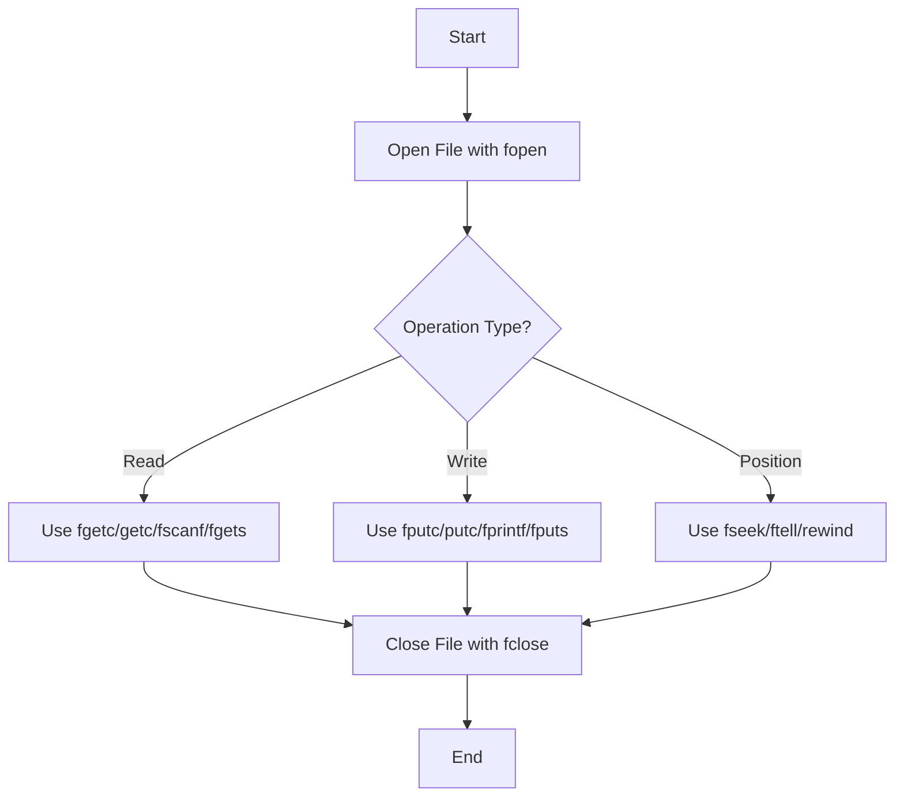
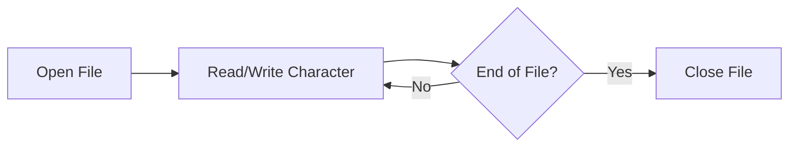

# File Handling in C

## Operations on Files

The two primary operations on files are:
- Reading the contents of the file
- Writing the contents to the file

**Note:** To perform any operation on files, the physical filename, the logical filename, and the mode must be connected using `fopen()`.

### Key Components

| Component | Description |
|-----------|-------------|
| **Physical Name** | A file maintained by the OS. The OS decides the naming convention of a file. |
| **Logical Name** | In a C Program, identifier used to refer to a file. Also called as File Handle. |
| **Mode** | Can be read only, write only, append or a combination of these. |

## File Operation Workflow



## C Functions for File Operations

| Operation | Functions | Description |
|-----------|-----------|-------------|
| **Open/Create** | `fopen()` | Creates new file or opens existing file |
| **Read** | `fgetc()`, `getc()`, `fscanf()`, `fgets()` | Read characters, formatted data, or strings |
| **Write** | `fputc()`, `putc()`, `fprintf()`, `fputs()` | Write characters, formatted data, or strings |
| **Position** | `fseek()`, `ftell()`, `rewind()` | Move to specific location in file |
| **Close** | `fclose()` | Close an open file |

## File Opening Modes

| Mode | Description | Action if File Exists | Action if File Doesn't Exist |
|------|-------------|----------------------|----------------------------|
| `"r"` | Read only | Opens file for reading | Returns NULL |
| `"w"` | Write only | Truncates file to zero length | Creates new file |
| `"a"` | Append | Opens file for writing at end | Creates new file |
| `"r+"` | Read and write | Opens file for reading and writing | Returns NULL |
| `"w+"` | Read and write | Truncates file to zero length | Creates new file |
| `"a+"` | Read and append | Opens file for reading and appending | Creates new file |

## Examples of File Operations

### Example 1: Writing to a File

```c
#include <stdio.h>

int main() {
    FILE *filePointer;
    char dataToWrite[] = "Example of writing to a file in C";
    
    // Opening file in writing mode
    filePointer = fopen("example.txt", "w");
    
    if (filePointer == NULL) {
        printf("File failed to open.");
        return 1;
    }
    
    // Writing data to file
    fprintf(filePointer, "%s", dataToWrite);
    
    // Closing file
    fclose(filePointer);
    
    printf("Data written to file successfully.");
    return 0;
}
```

### Example 2: Reading from a File

```c
#include <stdio.h>

int main() {
    FILE *filePointer;
    char dataToRead[100];
    
    // Opening file in reading mode
    filePointer = fopen("example.txt", "r");
    
    if (filePointer == NULL) {
        printf("File failed to open or doesn't exist.");
        return 1;
    }
    
    // Reading data from file
    fscanf(filePointer, "%[^\n]", dataToRead);
    
    // Closing file
    fclose(filePointer);
    
    printf("Data read from file: %s", dataToRead);
    return 0;
}
```

### Example 3: Appending to a File

```c
#include <stdio.h>

int main() {
    FILE *filePointer;
    char dataToAppend[] = "\nThis data will be appended.";
    
    // Opening file in append mode
    filePointer = fopen("example.txt", "a");
    
    if (filePointer == NULL) {
        printf("File failed to open.");
        return 1;
    }
    
    // Appending data to file
    fprintf(filePointer, "%s", dataToAppend);
    
    // Closing file
    fclose(filePointer);
    
    printf("Data appended to file successfully.");
    return 0;
}
```

## Character-wise File Operations



### Example: Character-by-Character Reading

```c
#include <stdio.h>

int main() {
    FILE *filePointer;
    char ch;
    
    filePointer = fopen("example.txt", "r");
    
    if (filePointer == NULL) {
        printf("File failed to open.");
        return 1;
    }
    
    printf("File contents:\n");
    
    // Read character by character
    while ((ch = fgetc(filePointer)) != EOF) {
        printf("%c", ch);
    }
    
    fclose(filePointer);
    return 0;
}
```

## Error Handling in File Operations

| Function | Return Value on Error | Description |
|----------|----------------------|-------------|
| `fopen()` | NULL | Returns NULL if file cannot be opened |
| `fclose()` | EOF (usually -1) | Returns EOF on error |
| `fgetc()`, `getc()` | EOF | Returns EOF on error or end of file |
| `fputc()`, `putc()` | EOF | Returns EOF on error |
| `ferror()` | Non-zero value | Returns non-zero if error occurred |
| `feof()` | Non-zero value | Returns non-zero if end of file reached |

## File Positioning Functions

| Function | Description | Example |
|----------|-------------|---------|
| `fseek(FILE *stream, long offset, int whence)` | Sets the file position indicator | `fseek(fp, 10, SEEK_SET)` moves to 10th byte from beginning |
| `ftell(FILE *stream)` | Returns current file position | `position = ftell(fp)` gets current position |
| `rewind(FILE *stream)` | Sets position to beginning of file | `rewind(fp)` moves to start of file |

### Whence Values for fseek()

| Constant | Description |
|----------|-------------|
| `SEEK_SET` | Beginning of file |
| `SEEK_CUR` | Current position |
| `SEEK_END` | End of file |

## Examples of File Handling Functions

### 1. `fopen()` - Opening a File

```c
#include <stdio.h>

int main() {
    // Different ways to use fopen()
    
    // 1. Opening a file for reading
    FILE *readFile = fopen("data.txt", "r");
    
    // 2. Opening a file for writing (creates new or truncates existing)
    FILE *writeFile = fopen("output.txt", "w");
    
    // 3. Opening a file for appending
    FILE *appendFile = fopen("log.txt", "a");
    
    // 4. Opening a binary file for reading
    FILE *binaryReadFile = fopen("image.jpg", "rb");
    
    // Always check if file opened successfully
    if (readFile == NULL) {
        printf("Failed to open data.txt for reading\n");
    }
    
    // Close files when done
    if (readFile) fclose(readFile);
    if (writeFile) fclose(writeFile);
    if (appendFile) fclose(appendFile);
    if (binaryReadFile) fclose(binaryReadFile);
    
    return 0;
}
```

### 2. Reading Functions

#### a. `fgetc()` and `getc()` - Reading a Character

```c
#include <stdio.h>

int main() {
    FILE *file = fopen("sample.txt", "r");
    if (file == NULL) {
        printf("Failed to open file\n");
        return 1;
    }
    
    // Using fgetc() to read character by character
    int c;
    printf("Reading with fgetc():\n");
    while ((c = fgetc(file)) != EOF) {
        putchar(c);
    }
    
    // Reset file position to beginning
    rewind(file);
    
    // Using getc() (functionally equivalent to fgetc)
    printf("\n\nReading with getc():\n");
    while ((c = getc(file)) != EOF) {
        putchar(c);
    }
    
    fclose(file);
    return 0;
}
```

#### b. `fscanf()` - Formatted Reading

```c
#include <stdio.h>

int main() {
    FILE *file = fopen("data.txt", "r");
    if (file == NULL) {
        printf("Failed to open file\n");
        return 1;
    }
   
   // Demo data --> data.txt contains: John 25 3.14
    char name[50];
    int age;
    float number;
    
    // Read formatted data
    fscanf(file, "%s %d %f", name, &age, &number);
    
    printf("Name: %s\n", name);
    printf("Age: %d\n", age);
    printf("Number: %.2f\n", number);
    
    fclose(file);
    return 0;
}
```

#### c. `fgets()` - Reading a String

```c
#include <stdio.h>

int main() {
    FILE *file = fopen("lines.txt", "r");
    if (file == NULL) {
        printf("Failed to open file\n");
        return 1;
    }
    
    char buffer[100];
    int lineCount = 0;
    
    // Read line by line
    while (fgets(buffer, sizeof(buffer), file) != NULL) {
        lineCount++;
        printf("Line %d: %s", lineCount, buffer);
    }
    
    fclose(file);
    return 0;
}
```

### 3. Writing Functions

#### a. `fputc()` and `putc()` - Writing a Character

```c
#include <stdio.h>

int main() {
    FILE *file = fopen("output.txt", "w");
    if (file == NULL) {
        printf("Failed to create file\n");
        return 1;
    }
    
    // Using fputc() to write character by character
    char message[] = "Hello using fputc()!";
    for (int i = 0; message[i] != '\0'; i++) {
        fputc(message[i], file);
    }
    
    fputc('\n', file);
    
    // Using putc() (functionally equivalent to fputc)
    char message2[] = "Hello using putc()!";
    for (int i = 0; message2[i] != '\0'; i++) {
        putc(message2[i], file);
    }
    
    fclose(file);
    printf("Data written to output.txt\n");
    return 0;
}
```

#### b. `fprintf()` - Formatted Writing

```c
#include <stdio.h>

int main() {
    FILE *file = fopen("report.txt", "w");
    if (file == NULL) {
        printf("Failed to create file\n");
        return 1;
    }
    
    char name[] = "Alice";
    int age = 30;
    float salary = 75000.50;
    
    // Write formatted data
    fprintf(file, "Name: %s\n", name);
    fprintf(file, "Age: %d\n", age);
    fprintf(file, "Salary: $%.2f\n", salary);
    
    // Write a table
    fprintf(file, "\n%-15s %-10s %-15s\n", "Name", "Age", "Salary");
    fprintf(file, "%-15s %-10d $%-14.2f\n", "Alice", 30, 75000.50);
    fprintf(file, "%-15s %-10d $%-14.2f\n", "Bob", 35, 82000.75);
    fprintf(file, "%-15s %-10d $%-14.2f\n", "Charlie", 28, 67500.25);
    
    fclose(file);
    printf("Report generated in report.txt\n");
    return 0;
}
```

#### c. `fputs()` - Writing a String

```c
#include <stdio.h>

int main() {
    FILE *file = fopen("notes.txt", "w");
    if (file == NULL) {
        printf("Failed to create file\n");
        return 1;
    }
    
    // Write strings to file
    fputs("Line 1: This is the first line.\n", file);
    fputs("Line 2: This is the second line.\n", file);
    fputs("Line 3: This is the third line.\n", file);
    
    fclose(file);
    printf("Data written to notes.txt\n");
    return 0;
}
```

### 4. File Positioning Functions

#### a. `fseek()` - Repositioning File Pointer

```c
#include <stdio.h>

int main() {
    FILE *file = fopen("data.bin", "wb+");
    if (file == NULL) {
        printf("Failed to create file\n");
        return 1;
    }
    
    // Write some data
    int numbers[] = {10, 20, 30, 40, 50};
    fwrite(numbers, sizeof(int), 5, file);
    
    // Move to specific positions and read
    
    // Move to the 3rd integer (position 8 = 2*sizeof(int))
    fseek(file, 2 * sizeof(int), SEEK_SET);
    int value;
    fread(&value, sizeof(int), 1, file);
    printf("3rd value (from SEEK_SET): %d\n", value);
    
    // Move 1 integer back from current position
    fseek(file, -1 * sizeof(int), SEEK_CUR);
    fread(&value, sizeof(int), 1, file);
    printf("Previous value (from SEEK_CUR): %d\n", value);
    
    // Move 2 integers back from end of file
    fseek(file, -2 * sizeof(int), SEEK_END);
    fread(&value, sizeof(int), 1, file);
    printf("2nd last value (from SEEK_END): %d\n", value);
    
    fclose(file);
    return 0;
}
```

#### b. `ftell()` - Getting Current Position

```c
#include <stdio.h>

int main() {
    FILE *file = fopen("sample.txt", "r");
    if (file == NULL) {
        printf("Failed to open file\n");
        return 1;
    }
    
    // Get initial position
    long position = ftell(file);
    printf("Initial position: %ld\n", position);
    
    // Read some characters
    for (int i = 0; i < 10; i++) {
        fgetc(file);
    }
    
    // Get new position
    position = ftell(file);
    printf("After reading 10 chars: %ld\n", position);
    
    // Move to end and get position (file size)
    fseek(file, 0, SEEK_END);
    position = ftell(file);
    printf("File size: %ld bytes\n", position);
    
    fclose(file);
    return 0;
}
```

#### c. `rewind()` - Resetting to Beginning

```c
#include <stdio.h>

int main() {
    FILE *file = fopen("text.txt", "r");
    if (file == NULL) {
        printf("Failed to open file\n");
        return 1;
    }
    
    // Read first character
    char first = fgetc(file);
    printf("First character: %c\n", first);
    
    // Read next 10 characters
    for (int i = 0; i < 10; i++) {
        fgetc(file);
    }
    
    // Current position
    printf("Current position: %ld\n", ftell(file));
    
    // Rewind to beginning
    rewind(file);
    printf("After rewind, position: %ld\n", ftell(file));
    
    // Read first character again
    first = fgetc(file);
    printf("First character again: %c\n", first);
    
    fclose(file);
    return 0;
}
```

### 5. `fclose()` - Closing a File

```c
#include <stdio.h>

int main() {
    // Open multiple files
    FILE *file1 = fopen("file1.txt", "w");
    FILE *file2 = fopen("file2.txt", "w");
    FILE *file3 = fopen("file3.txt", "w");
    
    // Check if files opened successfully
    if (file1 == NULL || file2 == NULL || file3 == NULL) {
        printf("Failed to open one or more files\n");
        
        // Close any files that were opened successfully
        if (file1) fclose(file1);
        if (file2) fclose(file2);
        if (file3) fclose(file3);
        
        return 1;
    }
    
    // Write some data
    fputs("Data for file 1", file1);
    fputs("Data for file 2", file2);
    fputs("Data for file 3", file3);
    
    // Close all files and check for errors
    if (fclose(file1) == EOF) {
        printf("Error closing file1.txt\n");
    }
    
    if (fclose(file2) == EOF) {
        printf("Error closing file2.txt\n");
    }
    
    if (fclose(file3) == EOF) {
        printf("Error closing file3.txt\n");
    }
    
    printf("All files closed successfully\n");
    return 0;
}
```


