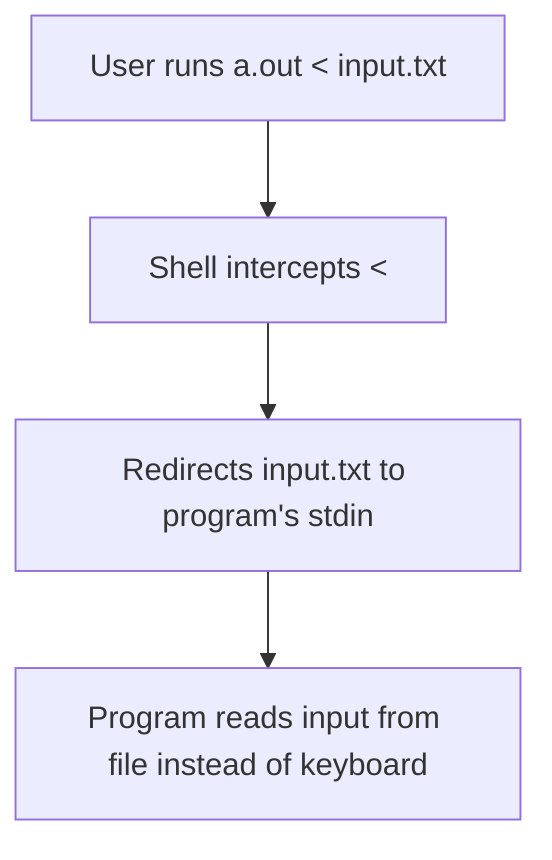

# Input Redirection in Command Line

## Intro →

The `<` operator is used in the command line (not in C code) to redirect input from a file to the program's standard input (stdin).

## Purpose

* Feed input data from a file to a program
* Useful for testing and automation
* Eliminates manual keyboard input

## Usage

```bash
./a.out < input.txt
```

OR

```bash
a.exe < input.txt
```

## How It Works



* Runs the program and takes input from `input.txt` instead of the keyboard
* If the file doesn't exist, the shell throws an error and the program does not execute

## Examples

### Example 1: Manual Input

```c
#include <stdio.h>
int main() {
  int num;
  printf("Reading numbers from input...\n");
  while (scanf("%d", &num) != EOF) {
    printf("Read number: %d\n", num);
  }
  return 0;
}
```

**Execution with manual input:**

```
C:\Users\De11>a
Reading numbers from input...
56
Read number: 56
-6
Read number: -6
34
Read number: 34
Out of application
```

### Example 2: Input Redirection

The same program can read from a file using input redirection:

```c
#include <stdio.h>
int main() {
  int num;
  printf("Reading numbers from input...\n");
  while (scanf("%d", &num) != EOF) {
    printf("Read number: %d\n", num);
  }
  return 0;
}
```

**Execution with input redirection:**

```
C:\Users\De11>a < numbers.txt
Reading numbers from input...
Read number: 3
Read number: 23
Read number: 44
Read number: 77
Read number: -15
Read number: 40
Read number: -266
Read number: 78
Read number: 22
Read number: 66
Read number: 90
Read number: 189
Out of application
```

> Note that the program code is identical in both examples - only the method of providing input changes.

## Disadvantages

| Disadvantage                        | Description                                                                                 |
| ----------------------------------- | ------------------------------------------------------------------------------------------- |
| No Error Handling in Code           | If the file doesn't exist, your program won't even start. You can't handle it in your code. |
| Limited to Standard Input (stdin)   | Only redirects stdin. Can't easily handle multiple files or write output simultaneously.    |
| Not Portable Across All Systems     | May not behave consistently in all IDEs or Windows environments.                            |
| Not Flexible for Dynamic File Names | You must know the filename in advance and specify it at the command line.                   |
