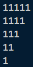

### 1> *Compilation and Execution*

```sh
gcc filename.c -o filename.exe
```
or
```sh
gcc filename.c -o filename
```

### 2> *Running the Executable*

```sh
./filename.exe
```

## *Output*



### *Prerequisites*
- GCC (GNU Compiler Collection)
- A text editor